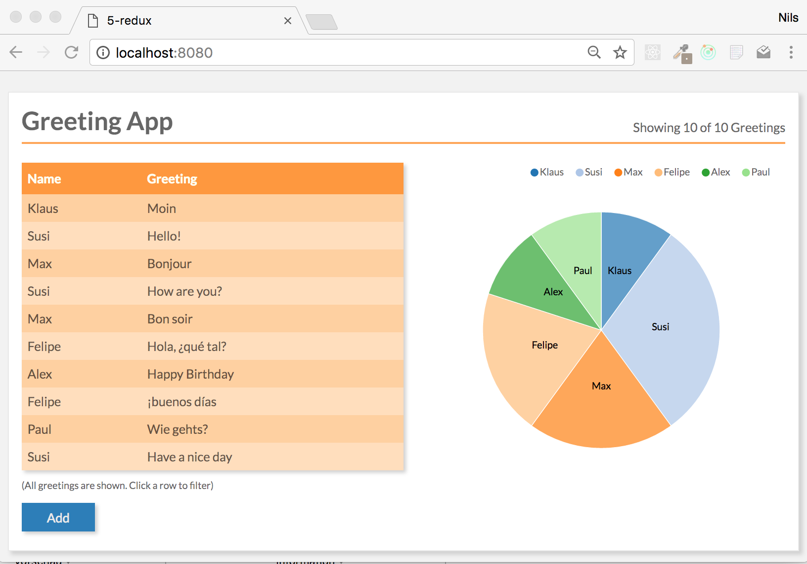

# +++ REPOSITORY VERSCHOBEN +++

Wir haben das Repository (samt neuer Git-History) verschoben (26. Januar 2017):

* https://github.com/reactbuch/react-workshop

Alle Änderungen finden künftig dort statt.

# React Workshop

Dieses Repository enthält Materialen zu React Workshops von [Nils Hartmann](http://nilshartmann.net) und [Oliver Zeigermann](http://zeigermann.eu/).

# Interesse an React Workshops, Schulungen oder Coaching?

Wir bieten diesen Workshop unter anderem auch in einer mehrtägigen Variante oder auch individuelle Trainings und Beratung an.
Wenn Du noch Unterstützung beim Einstieg in React oder bei der Entwicklung mit React hast, kannst Du uns gerne [kontaktieren](autoren@reactbuch.de). Weitere Informationen zu unserem Workshop- und Beratungsangebot findest Du auch unter https://react-workshop.de.

# Beispiel Anwendung

